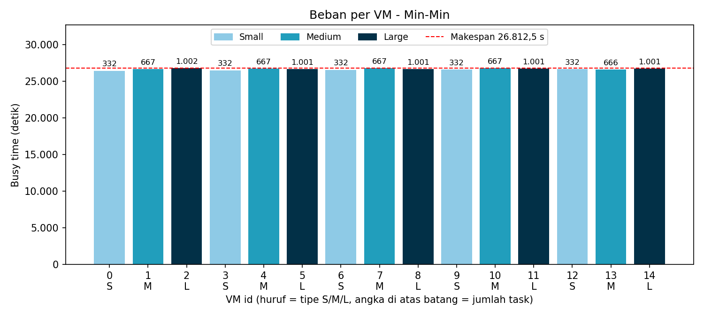
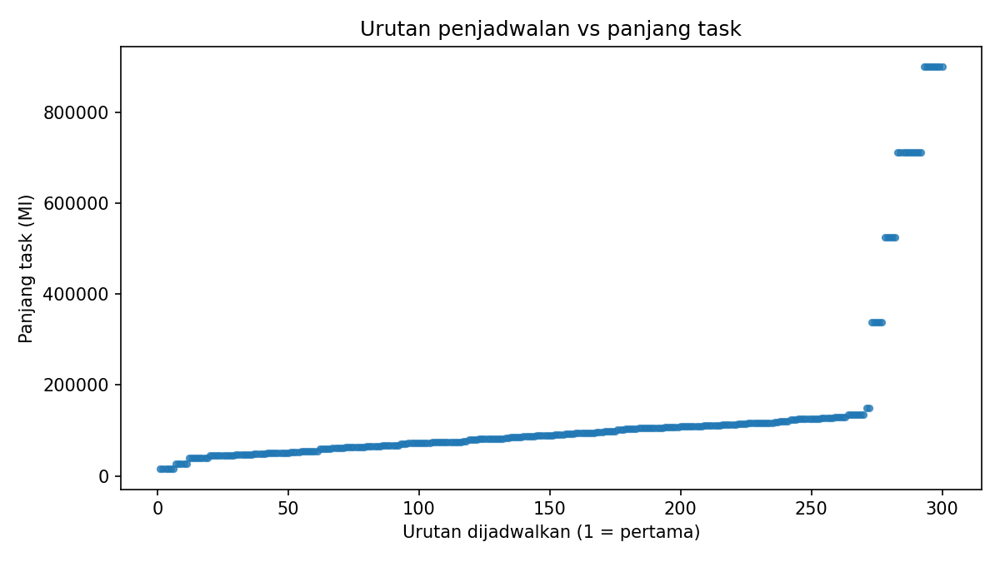
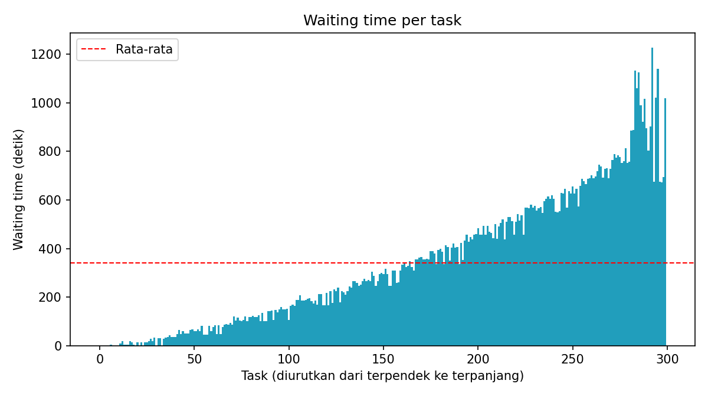

# Simulasi Min-Min Heuristic di CloudSim

Tugas SOKA (Semester 5, Kelas B), **Kelompok 7**. Repo ini berisi simulasi penjadwalan task cloud memakai algoritma **Min-Min** di **CloudSim 3.0.3**, dengan dataset **GoCJ** (300 task) pada datacenter heterogen (5 host, 15 VM).

## Anggota

| NRP | Nama |
|---|---|
| 5027241021 | Mochkamad Maulana Syafaat |
| 5027241052 | Salsa Bil Ulla |
| 5027241049 | Khumaidi Kharis Az-zacky |
| 5027241016 | Shinta Alya Ramadani |
| 5027241041 | Raya Ahmad Syarif |

## Cara menjalankan

Butuh **JDK 11 ke atas** (cek dengan `javac -version`) dan **Python 3** untuk grafik.

```
.\build_run.bat                                    # Windows
bash build_run.sh                                  # Linux / WSL / Mac
python -m pip install pandas matplotlib scipy      # sekali saja
python analysis/plot_results.py                    # bikin grafik + angka analisis
```

Kalau berhasil, terminal menampilkan `SEMUA UJI LULUS`, lalu `SEMUA VALIDASI LULUS`. Semua hasil tersimpan di folder `results/`.

---

## Laporan

### B.1 Jenis workload dan dataset

- **Independent task**: tiap task berdiri sendiri, tanpa ketergantungan antar-task.
- **Non-preemptive**: task yang sudah berjalan tidak dihentikan sampai selesai.
- **Batch / statis**: seluruh 300 task tiba di t = 0 dan panjangnya diketahui sebelum penjadwalan dimulai.
- **Dataset GoCJ (Google Cloud Jobs)**: dataset sintetis dengan pola workload dari Google cluster traces. Ukuran task dalam Million Instructions (MI).

Ringkasan dataset yang dipakai (`data/GoCJ_Dataset_300.txt`): n = 300, min = 15.000 MI, max = 900.000 MI, rata-rata = 138.420 MI, total = 41.526.000 MI.

Referensi: Hussain, A., & Aleem, M. (2018). GoCJ: Google Cloud Jobs Dataset for Distributed and Cloud Computing Infrastructures. *Data*, 3(4), 38. https://doi.org/10.3390/data3040038 · Data: https://data.mendeley.com/datasets/b7bp6xhrcd/1

### B.2 Desain arsitektur cloud

1 datacenter, 5 host, 15 VM (tiap host menampung 1 VM Small, 1 Medium, 1 Large), 300 cloudlet. Semua parameter ada di `src/config/SimConfig.java`.

| Host | PE | MIPS per PE | RAM |
|---|---|---|---|
| 1 | 4 | 3000 | 16 GB |
| 2 | 4 | 3000 | 16 GB |
| 3 | 6 | 3500 | 24 GB |
| 4 | 6 | 3500 | 24 GB |
| 5 | 8 | 4000 | 32 GB |

| Tipe VM | MIPS | RAM | PE |
|---|---|---|---|
| Small | 1000 | 1 GB | 1 |
| Medium | 2000 | 2 GB | 1 |
| Large | 3000 | 4 GB | 1 |

- VM 0–2 di Host 1, VM 3–5 di Host 2, dan seterusnya sampai VM 12–14 di Host 5.
- Penjadwal cloudlet di VM: *space-shared* (satu task per VM pada satu waktu).
- Nilai berikut **bukan bagian rancangan awal (slide) dan diasumsikan seragam**: bandwidth host 10.000, storage host 1.000.000 MB, image VM 10.000 MB, bandwidth VM 1.000. Heterogenitas pada simulasi ini berasal dari CPU dan RAM, bukan dari bandwidth atau storage.

### B.3 Algoritma yang diimplementasikan: Min-Min

Min-Min memilih, dari semua task yang belum dijadwalkan, task yang punya waktu selesai (CT) minimum paling kecil, lalu menugaskannya ke VM yang memberi CT tersebut. Prosesnya diulang sampai semua task terjadwal.

```
CT[i][j] = ready[j] + MI[i] / MIPS[j]

ready[j] = 0 untuk setiap VM j
U = himpunan task yang belum dijadwalkan
selama U tidak kosong:
    untuk setiap task i di U:
        vm_terbaik[i] = j dengan CT[i][j] terkecil   (seri: indeks j terkecil)
    i* = task dengan CT[i][vm_terbaik[i]] terkecil
    tugaskan i* ke vm_terbaik[i*]
    ready[vm_terbaik[i*]] = CT[i*][vm_terbaik[i*]]
    hapus i* dari U
```

Pemetaan dihitung sekali sebelum eksekusi (static), lalu dipasang ke CloudSim lewat `bindCloudletToVm`. Kompleksitas kira-kira O(n² × m).

> Hanya Min-Min yang diimplementasikan di repo ini. Max-Min muncul sebagai pembanding konsep pada contoh mini di PPT (slide 8), tidak dijalankan pada 300 task.

Referensi: Braun, T.D. et al. (2001). A comparison of eleven static heuristics for mapping a class of independent tasks onto heterogeneous distributed computing systems. *JPDC*, 61(6), 810–837.

### B.4 Fungsi objektif

1. **Minimasi makespan**: waktu sampai task terakhir selesai.
2. **Maksimasi resource utilization**: seberapa sibuk VM selama simulasi.

### B.5 Metrik dan batasan

| Metrik | Formula |
|---|---|
| Makespan | max(waktu selesai semua task) |
| Resource Utilization | Total busy time ÷ (Makespan × 15) × 100% |
| Average Waiting Time | Σ(waktu mulai − waktu submit) ÷ n |
| Throughput | n task selesai ÷ Makespan |

Batasan:
- **Kapasitas resource**: alokasi VM ke host tidak melebihi kapasitas CPU dan RAM host.
- **Kapasitas VM**: tiap VM 1 PE, menjalankan satu task pada satu waktu.
- **Non-preemptive**: task berjalan sampai selesai.
- **Konfigurasi konsisten**: dataset, jumlah task, jumlah VM, dan skala MI (`MI_SCALE = 1.0`) tetap selama simulasi.

---

## Hasil (dataset GoCJ asli)

| Metrik | Nilai |
|---|---|
| Makespan | 1594,00 detik (prediksi Min-Min: 1594,00) |
| Batas bawah teoritis makespan | 1384,20 detik |
| Resource Utilization | 86,87% |
| Average Waiting Time | 339,79 detik |
| Throughput | 0,1882 task/detik |
| Task sukses | 300 dari 300 |

### Grafik

**Beban tiap VM** (utilisasi 43,91–100%, ketimpangan terkumpul di VM 12 dan VM 1)



**Urutan dijadwalkan vs panjang task** (Spearman = 1,000: task pendek selalu duluan)



**Waiting time per task** (task terpendek rata-rata 42,73 dtk, terpanjang 728,12 dtk)



### Validasi otomatis

Program mengecek dirinya sendiri (V2–V9), semuanya lulus: 300 cloudlet sukses, tiap task jalan di VM hasil Min-Min, makespan CloudSim cocok dengan prediksi (selisih 0,0045 dtk), makespan ≥ batas bawah teoritis, utilization ≤ 100%, tidak ada task tumpang tindih di satu VM, penempatan VM ke host sesuai rancangan, dan penjadwal deterministik (dua kali jalan hasilnya sama).

## Analisis: apakah dugaan di PPT terbukti?

Slide 10 PPT menulis kelebihan dan keterbatasan Min-Min sebagai dugaan. Ini hasilnya terhadap data simulasi:

| Dugaan | Hasil | Bukti |
|---|---|---|
| Sederhana dan mudah diimplementasikan | Tidak diukur | Bersifat kualitatif. Penjadwal hanya satu file (`MinMinScheduler.java`) dan bisa diuji tanpa CloudSim. |
| Pemetaan dihitung sekali sebelum eksekusi (static) | Sesuai desain | Pemetaan dihitung di awal lalu dipasang ke broker. Validasi V4c dan V8 lulus. |
| Banyak task kecil selesai lebih cepat | Didukung | 79 task terpendek (25% terbawah) selesai rata-rata di detik ke-65,4 dan paling lambat di detik ke-141,7. 75 task terpanjang selesai rata-rata di detik ke-892,2. Tidak ada algoritma pembanding yang dijalankan, jadi "lebih cepat" hanya terbukti secara absolut. |
| Task besar dijadwalkan belakangan dan menunggu lama | Didukung kuat | Korelasi Spearman urutan dijadwalkan vs panjang task = 1,000. Waiting rata-rata task terpendek 42,73 dtk, task terpanjang 728,12 dtk. Tiga task 900.000 MI mulai di detik ke-674, 676, dan 694. |
| Beban antar-VM berpotensi tidak seimbang | Didukung sebagian | Utilisasi VM berkisar 43,91–100% (simpangan baku 14,3 poin), tetapi 13 dari 15 VM di atas 80%. Ketimpangan terkumpul di VM 12 (43,91%) dan VM 1 (72,82%). Rata-rata per tipe hampir rata: Small 88,03%, Medium 84,74%, Large 87,84%. Makespan 15,2% di atas batas bawah teoritis. |
| Panjang task harus diketahui di awal | Sesuai desain | Rumus CT memerlukan MI seluruh task. Tidak diuji dengan skenario lain. |

Task terakhir (900.000 MI) jatuh ke VM 9 (Small) dan itulah yang menentukan makespan. Penyebab VM 12 paling sedikit terpakai belum diselidiki.

## Isi folder

```
src/          kode Java
  config/       SimConfig.java (semua parameter ada di sini)
  data/         GoCJLoader
  scheduler/    MinMinScheduler
  infra/        DatacenterFactory, VmFactory, CloudletFactory, MappedVmAllocationPolicy
  metrics/      MetricsCalculator, Validator, ResultWriter
  app/          MainMinMin (program utama), SchedulerSelfTest
data/         dataset GoCJ (yang dipakai: GoCJ_Dataset_300.txt)
results/      hasil final (CSV, grafik, console output)
analysis/     plot_results.py
tools/        generator data uji (bukan untuk hasil final)
lib/          cloudsim-3.0.3.jar
docs/         panduan per peran dan catatan
```

## Catatan

- Jangan ubah `data/GoCJ_Dataset_300.txt`. Kalau dataset atau parameter di `SimConfig.java` diganti, jalankan ulang `build_run` dan commit ulang isi `results/`.
- Cek lisensi dataset di halaman Mendeley Data sebelum repo dibuat publik.
