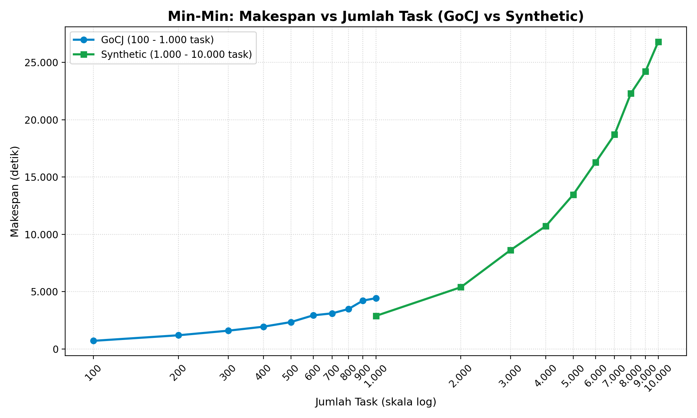

# Simulasi Min-Min Heuristic di CloudSim

Tugas SOKA (Semester 5, Kelas B), **Kelompok 7**. Repo ini berisi simulasi penjadwalan task cloud memakai algoritma **Min-Min** (Min Heuristic) di **CloudSim 3.0.3**. Pengujian memakai **dataset GoCJ** dan **dataset Synthetic buatan sendiri** pada datacenter heterogen: 1 datacenter, 5 host, 15 VM.

## Anggota

| NRP | Nama |
|---|---|
| 5027241021 | Mochkamad Maulana Syafaat |
| 5027241052 | Salsa Bil Ulla |
| 5027241049 | Khumaidi Kharis Az-zacky |
| 5027241016 | Shinta Alya Ramadani |
| 5027241041 | Raya Ahmad Syarif |

---

## Ringkasan Pemenuhan Revisi Dosen

| Revisi | Status | Lokasi |
|---|---|---|
| GoCJ: 100, 200, ..., 1.000 task (kelipatan 100) | Selesai | `data/GoCJ_Dataset_100.txt` s.d. `_1000.txt` |
| Fokus 1 algoritma: Min Heuristic (Min-Min) | Selesai | `src/scheduler/MinMinScheduler.java` |
| 1 Data Center, 5 Host, tiap Host 3 VM (S/M/L = 1.000/2.000/3.000 MIPS, 1 PE), total 15 VM, heterogen | Selesai | [Peta Kode](#peta-kode-untuk-demo) |
| Kode DC, Host, dan penempatan VM jelas | Selesai | [Peta Kode](#peta-kode-untuk-demo) |
| Synthetic: 1.000, 2.000, ..., 10.000 task, distribusi dibuat sendiri | Selesai | `data/Synthetic_*.txt`, `tools/make_synthetic.py` |
| Grafik Makespan vs jumlah task, GoCJ dan Synthetic dibedakan | Selesai | `results/grafik_makespan.png` |
| Perbandingan dengan algoritma lain | Tidak dilakukan (opsional) | - |

---

## Struktur Folder

```
├── src/
│   ├── config/SimConfig.java        # semua parameter simulasi (host, VM, dataset)
│   ├── infra/                       # DatacenterFactory, VmFactory, CloudletFactory, MappedVmAllocationPolicy
│   ├── scheduler/MinMinScheduler.java
│   ├── data/GoCJLoader.java         # pembaca dataset (1 angka MI per baris)
│   ├── metrics/                     # hitung metrik, validasi, tulis CSV
│   └── app/                         # MainMinMin (1 dataset), BatchRunner (banyak dataset), SchedulerSelfTest
├── data/                            # dataset GoCJ dan Synthetic
├── tools/make_synthetic.py          # generator dataset Synthetic
├── analysis/                        # plot_makespan.py (grafik batch), plot_results.py (grafik single run)
├── results/                         # CSV hasil dan grafik
├── lib/cloudsim-3.0.3.jar
├── run_batch.sh                     # batch GoCJ + Synthetic + grafik
├── build_run.sh / build_run.bat     # build + tes + single run
└── docs/                            # catatan kerja internal kelompok
```

---

## Cara Menjalankan

Kebutuhan: **JDK 11 ke atas** (cek `javac -version`) dan **Python 3** dengan `matplotlib` dan `pandas` untuk grafik.

### A. Linux / macOS / WSL / Git Bash

```bash
# 1. Setup Python (sekali saja)
python3 -m venv .venv
.venv/bin/pip install matplotlib pandas

# 2. Batch: 10 dataset GoCJ + 10 dataset Synthetic + grafik makespan
bash run_batch.sh

# 3. Satu dataset saja (tanpa argumen, default GoCJ_Dataset_300.txt)
bash build_run.sh data/GoCJ_Dataset_300.txt
bash build_run.sh data/Synthetic_1000.txt
.venv/bin/python analysis/plot_results.py     # 3 grafik detail untuk single run terakhir
```

### B. Windows (PowerShell)

`run_batch.sh` butuh bash. Kalau tidak memakai Git Bash/WSL, jalankan langkah yang sama secara manual dari folder repo:

```powershell
# 1. Setup Python (sekali saja)
pip install matplotlib pandas

# 2. Compile
if (Test-Path out) { Remove-Item out -Recurse -Force }
mkdir out
javac -encoding UTF-8 -cp "lib\cloudsim-3.0.3.jar" -d out src\config\*.java src\data\*.java src\infra\*.java src\scheduler\*.java src\metrics\*.java src\app\*.java

# 3. Batch GoCJ (100 - 1.000) dan Synthetic (1.000 - 10.000)
mkdir results -Force
$gocj  = 1..10 | ForEach-Object { "data/GoCJ_Dataset_$($_ * 100).txt" }
$synth = 1..10 | ForEach-Object { "data/Synthetic_$($_ * 1000).txt" }
java -cp "out;lib\cloudsim-3.0.3.jar" app.BatchRunner GoCJ results/batch_gocj.csv @gocj
java -cp "out;lib\cloudsim-3.0.3.jar" app.BatchRunner Synthetic results/batch_synthetic.csv @synth

# 4. Grafik
python analysis\plot_makespan.py
```

Satu dataset saja di Windows: `.\build_run.bat data\GoCJ_Dataset_300.txt`

### Output

| File | Isi |
|---|---|
| `results/batch_gocj.csv` | Hasil 10 dataset GoCJ |
| `results/batch_synthetic.csv` | Hasil 10 dataset Synthetic |
| `results/grafik_makespan.png` | Grafik Makespan vs Jumlah Task |

Membuat ulang dataset Synthetic: `python tools/make_synthetic.py` (seed tetap 2024, hasilnya selalu sama).

---

## Peta Kode untuk Demo

| Yang dijelaskan | File | Bagian |
|---|---|---|
| Semua spesifikasi (host, VM, jumlah) | `src/config/SimConfig.java` | `NUM_HOST = 5`, `VMS_PER_HOST = 3`, `HOST_PES`, `HOST_PE_MIPS`, `HOST_RAM_MB`, `VM_TYPE_MIPS = {1000, 2000, 3000}`, `VM_PES = 1` |
| **1 Data Center dibuat** | `src/infra/DatacenterFactory.java` | `create()`, di baris akhir: `return new Datacenter(...)` |
| **5 Host dibuat** | `src/infra/DatacenterFactory.java` | loop `for (int h = 0; h < NUM_HOST; h++)`: tiap host punya jumlah PE, MIPS, dan RAM sendiri (heterogen) |
| **15 VM dibuat** | `src/infra/VmFactory.java` | loop `for (int id = 0; id < NUM_VM; id++)`: pola Small, Medium, Large diulang 5 kali |
| **3 VM di-assign ke tiap Host** | `src/infra/MappedVmAllocationPolicy.java` | `allocateHostForVm()` memakai `vmId / 3` sebagai indeks host: VM 0-2 ke Host 1, VM 3-5 ke Host 2, ..., VM 12-14 ke Host 5 |
| Algoritma Min-Min | `src/scheduler/MinMinScheduler.java` | `schedule()` |
| Alur simulasi (init, DC, VM, bind, start) | `src/app/MainMinMin.java` dan `src/app/BatchRunner.java` | `CloudSim.init` → `DatacenterFactory.create` → `VmFactory.create` → `bindCloudletToVm` → `startSimulation` |
| Generator dataset Synthetic | `tools/make_synthetic.py` | `DISTRIBUTION` |

---

## Laporan

### B.1 Jenis Workload dan Dataset

- **Independent task**: tiap task berdiri sendiri, tanpa ketergantungan antar-task.
- **Non-preemptive**: task yang sudah berjalan di VM tidak dihentikan sampai selesai.
- **Batch / statis**: seluruh task tiba di t = 0 dan panjang instruksinya diketahui sebelum penjadwalan dimulai.

Sesuai revisi dosen, pengujian memakai dua dataset:

1. **Dataset GoCJ (Google Cloud Jobs)**
   - Ukuran task dalam Million Instructions (MI), berkisar **15.000 sampai 900.000 MI**.
   - Dijalankan pada **100–1.000 task (kelipatan 100)**: `GoCJ_Dataset_100.txt` sampai `GoCJ_Dataset_1000.txt`.
   - Nilai MI pada tiap file berasal dari 50 nilai unik di `Original_DataSet.txt`. Tiap file adalah **sampel tersendiri**, bukan potongan dari file yang lebih besar (misalnya isi file 100 task berbeda dengan 100 baris pertama file 200 task).
   - Referensi: Hussain, A., & Aleem, M. (2018). GoCJ: Google Cloud Jobs Dataset for Distributed and Cloud Computing Infrastructures. *Data*, 3(4), 38. https://doi.org/10.3390/data3040038 · Data: https://data.mendeley.com/datasets/b7bp6xhrcd/1

2. **Synthetic Dataset (buatan sendiri)**
   - Dibuat dengan `tools/make_synthetic.py` untuk menguji beban besar: **1.000–10.000 task (kelipatan 1.000)**.
   - Distribusi task (target generator):

     | Kelas | Rentang | Porsi target | Porsi terukur di data |
     |---|---|---|---|
     | Kecil | 10.000 – 50.000 MI | 60% | ±58–60% |
     | Sedang | 50.000 – 150.000 MI | 30% | ±30–32% |
     | Besar | 150.000 – 500.000 MI | 10% | ±10–11% |

     Porsi terukur sedikit bergeser dari target karena pemilihan kelas dilakukan acak.

### B.2 Desain Arsitektur Cloud

1 datacenter, 5 host heterogen, 15 VM. Tiap host menampung 1 VM Small, 1 Medium, dan 1 Large, dan tiap VM memiliki 1 PE. Semua parameter ada di `src/config/SimConfig.java`.

| Host | PE | MIPS per PE | RAM | VM yang ditempatkan |
|---|---|---|---|---|
| 1 | 4 | 3000 | 16 GB | VM 0 (S), VM 1 (M), VM 2 (L) |
| 2 | 4 | 3000 | 16 GB | VM 3 (S), VM 4 (M), VM 5 (L) |
| 3 | 6 | 3500 | 24 GB | VM 6 (S), VM 7 (M), VM 8 (L) |
| 4 | 6 | 3500 | 24 GB | VM 9 (S), VM 10 (M), VM 11 (L) |
| 5 | 8 | 4000 | 32 GB | VM 12 (S), VM 13 (M), VM 14 (L) |

| Tipe VM | MIPS | RAM | PE | Penjadwal cloudlet |
|---|---|---|---|---|
| Small | 1.000 | 1 GB | 1 | Space-Shared |
| Medium | 2.000 | 2 GB | 1 | Space-Shared |
| Large | 3.000 | 4 GB | 1 | Space-Shared |

- Penjadwal cloudlet di VM adalah *space-shared*: satu task per VM pada satu waktu.
- Nilai berikut dibuat seragam: bandwidth host 10.000, storage host 1.000.000 MB, image VM 10.000 MB, bandwidth VM 1.000. Heterogenitas simulasi ini berasal dari CPU dan RAM host, serta MIPS dan RAM tiap tipe VM.
- Total kapasitas 15 VM = 5 × (1.000 + 2.000 + 3.000) = 30.000 MIPS.

### B.3 Algoritma: Min-Min

Min-Min memilih, dari semua task yang belum dijadwalkan, task yang punya waktu selesai (CT) minimum paling kecil, lalu menugaskannya ke VM yang memberi CT tersebut. Proses diulang sampai semua task terjadwal. Task pendek cenderung dijadwalkan lebih dulu.

```
CT[i][j] = ready[j] + MI[i] / MIPS[j]

ready[j] = 0 untuk setiap VM j
U = himpunan task yang belum dijadwalkan
selama U tidak kosong:
    untuk setiap task i di U:
        vm_terbaik[i] = j dengan CT[i][j] terkecil   (seri: indeks j terkecil)
    i* = task dengan CT[i][vm_terbaik[i]] terkecil
    tugaskan i* ke vm_terbaik[i*]
    ready[vm_terbaik[i*]] = CT[i*][vm_terbaik[i*]]
    hapus i* dari U
```

Pemetaan dihitung sekali sebelum eksekusi (static), lalu dipasang ke CloudSim lewat `bindCloudletToVm`.

Referensi: Braun, T.D. et al. (2001). A comparison of eleven static heuristics for mapping a class of independent tasks onto heterogeneous distributed computing systems. *JPDC*, 61(6), 810–837.

### B.4 Fungsi Objektif

1. **Minimasi makespan**: waktu sampai task terakhir selesai.
2. **Maksimasi resource utilization**: seberapa sibuk VM selama simulasi.

### B.5 Metrik dan Batasan

| Metrik | Formula |
|---|---|
| Makespan | max(waktu selesai semua task) |
| Resource Utilization | Total busy time ÷ (Makespan × 15) × 100% |
| Average Waiting Time | Σ(waktu mulai − waktu submit) ÷ n |
| Throughput | n task selesai ÷ Makespan |

Batasan:
- **Kapasitas resource**: alokasi VM ke host tidak melebihi kapasitas CPU dan RAM host.
- **Kapasitas VM**: tiap VM 1 PE, menjalankan satu task pada satu waktu.
- **Non-preemptive**: task berjalan sampai selesai.
- **Konfigurasi konsisten**: jumlah VM dan skala MI (`MI_SCALE = 1.0`) tetap selama simulasi.

---

## Hasil Pengujian

### 1. Grafik Makespan vs Jumlah Task

Panel kiri GoCJ (100–1.000 task), panel kanan Synthetic (1.000–10.000 task). Garis biru/hijau adalah hasil simulasi CloudSim, garis putus-putus adalah prediksi Min-Min.


**Grafik gabungan** 

GoCJ dan Synthetic digambar pada satu grafik sebagai dua series (biru = GoCJ, hijau = Synthetic). Sumbu X memakai skala log karena rentang GoCJ (100–1.000) jauh lebih kecil daripada Synthetic (1.000–10.000). Kedua series berasal dari dataset berbeda, jadi tidak bisa dibaca sebagai satu kurva yang menyambung. Pada 1.000 task, makespan Synthetic (2.882,63 s) lebih rendah daripada GoCJ (4.428,60 s) karena task Synthetic rata-rata lebih pendek, bukan karena kesalahan algoritma.



### 2. Tabel Hasil

#### GoCJ Dataset (100 – 1.000 task)

| Task | Makespan Simulasi (s) | Prediksi Min-Min (s) | Resource Utilization | Avg Waiting (s) | Throughput (task/s) |
|---|---|---|---|---|---|
| 100 | 708,00 | 708,00 | 55,36% | 103,50 | 0,1412 |
| 200 | 1193,75 | 1193,75 | 66,37% | 222,44 | 0,1675 |
| 300 | 1594,00 | 1594,00 | 86,87% | 339,79 | 0,1882 |
| 400 | 1942,36 | 1942,33 | 87,84% | 486,74 | 0,2059 |
| 500 | 2344,16 | 2344,17 | 88,75% | 595,12 | 0,2133 |
| 600 | 2933,16 | 2933,17 | 93,52% | 721,52 | 0,2046 |
| 700 | 3106,27 | 3106,25 | 91,77% | 839,97 | 0,2254 |
| 800 | 3485,49 | 3485,50 | 92,90% | 941,04 | 0,2295 |
| 900 | 4219,63 | 4219,50 | 92,99% | 1117,03 | 0,2133 |
| 1000 | 4428,60 | 4428,50 | 96,82% | 1234,01 | 0,2258 |

#### Synthetic Dataset (1.000 – 10.000 task)

| Task | Makespan Simulasi (s) | Prediksi Min-Min (s) | Resource Utilization | Avg Waiting (s) | Throughput (task/s) |
|---|---|---|---|---|---|
| 1.000 | 2882,63 | 2882,50 | 94,86% | 643,34 | 0,3469 |
| 2.000 | 5388,08 | 5388,00 | 96,87% | 1268,82 | 0,3712 |
| 3.000 | 8631,99 | 8632,00 | 99,00% | 1993,30 | 0,3475 |
| 4.000 | 10730,19 | 10729,50 | 98,53% | 2572,21 | 0,3728 |
| 5.000 | 13470,45 | 13469,83 | 98,61% | 3218,70 | 0,3712 |
| 6.000 | 16287,51 | 16287,00 | 99,35% | 3886,64 | 0,3684 |
| 7.000 | 18705,92 | 18705,25 | 99,10% | 4454,47 | 0,3742 |
| 8.000 | 22307,52 | 22307,00 | 99,27% | 5227,46 | 0,3586 |
| 9.000 | 24204,80 | 24203,67 | 99,51% | 5785,86 | 0,3718 |
| 10.000 | 26812,48 | 26812,00 | 99,49% | 6433,77 | 0,3730 |

### 3. Analisis

- **Makespan naik seiring jumlah task.** Di kedua dataset, makespan selalu naik saat task bertambah. Pada Synthetic kenaikannya mendekati linier, rata-rata sekitar 2.700 detik per tambahan 1.000 task (per langkah berkisar 1.900–3.600 detik), karena semua file dibuat dengan distribusi yang sama. Pada GoCJ kenaikannya tidak semulus itu (misalnya +589 detik dari 500 ke 600 task, tetapi hanya +173 detik dari 600 ke 700 task). Penyebabnya ada di data, bukan di algoritma: tiap file GoCJ adalah sampel tersendiri, sehingga komposisi task panjang dan pendek berbeda dari satu file ke file lain.
- **Resource utilization naik pada beban besar.** Pada GoCJ 100–200 task, utilisasi baru 55–66% karena task terlalu sedikit untuk memenuhi 15 VM. Pada 1.000 task, utilisasi mencapai 96,8%, dan pada Synthetic 3.000–10.000 task stabil di 98–99%.
- **Throughput.** Throughput GoCJ naik dari 0,14 ke sekitar 0,22 task/s mengikuti naiknya utilisasi. Pada Synthetic throughput stabil di sekitar 0,35–0,37 task/s karena VM sudah hampir penuh terpakai.
- **Simulasi cocok dengan prediksi penjadwal.** Makespan CloudSim dan prediksi Min-Min hampir berimpit. Selisih terbesar pada GoCJ 0,13 detik, dan pada Synthetic 1,13 detik (9.000 task), atau paling besar sekitar 0,007% dari makespan. Selisih sekecil ini diduga berasal dari pembulatan internal CloudSim. Hasilnya menunjukkan pemetaan task ke VM berjalan sesuai perhitungan algoritma.

### 4. Keterbatasan

- Hanya Min-Min yang diimplementasikan. Belum ada perbandingan dengan algoritma lain.
- Tiap titik grafik berasal dari satu kali run pada satu dataset. Algoritma bersifat deterministik, jadi mengulang run pada dataset yang sama menghasilkan angka yang sama.
- Dataset GoCJ berukuran berbeda adalah sampel independen, sehingga grafik GoCJ tidak mulus.
