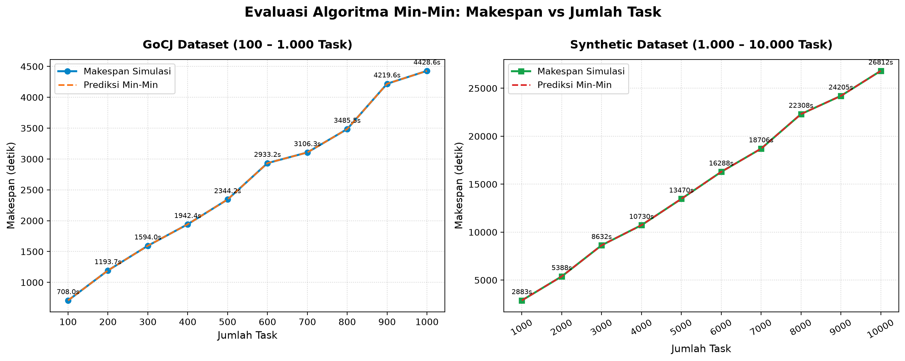

# Simulasi Min-Min Heuristic di CloudSim

Tugas SOKA (Semester 5, Kelas B), **Kelompok 7**. Repo ini berisi simulasi penjadwalan task cloud memakai algoritma **Min-Min** di **CloudSim 3.0.3**, dengan dataset **GoCJ** dan **Synthetic Dataset** pada datacenter heterogen (5 host, 15 VM).

## Anggota

| NRP | Nama |
|---|---|
| 5027241021 | Mochkamad Maulana Syafaat |
| 5027241052 | Salsa Bil Ulla |
| 5027241049 | Khumaidi Kharis Az-zacky |
| 5027241016 | Shinta Alya Ramadani |
| 5027241041 | Raya Ahmad Syarif |

---

## Cara Menjalankan

Butuh **JDK 11 ke atas** (cek dengan `javac -version`) dan **Python 3** untuk grafik.

### 1. Setup Environment Python (sekali saja)
```bash
python3 -m venv .venv
.venv/bin/pip install matplotlib pandas
```

### 2. Jalankan Batch Run (Revisi Dosen: Semua Dataset Sekaligus)
Menjalankan pengujian 10 dataset GoCJ (100–1.000 task) dan 10 dataset Synthetic (1.000–10.000 task) dalam satu perintah, lalu langsung membuat grafik Makespan:
```bash
bash run_batch.sh
```
Output tersimpan di:
- `results/batch_gocj.csv`
- `results/batch_synthetic.csv`
- `results/grafik_makespan.png`

### 3. Jalankan Satu Dataset Saja (Single Run)
Bisa langsung mengoper path file dataset sebagai argumen:
```bash
# Contoh dataset GoCJ:
bash build_run.sh data/GoCJ_Dataset_300.txt

# Atau dataset sintetis:
bash build_run.sh data/Synthetic_1000.txt
```
Lalu jalankan script analisis untuk 3 grafik detail (beban VM, urutan task, waiting time):
```bash
.venv/bin/python analysis/plot_results.py
```

---

## Laporan

### B.1 Jenis Workload dan Dataset

- **Independent task**: Tiap task berdiri sendiri, tanpa ketergantungan antar-task.
- **Non-preemptive**: Task yang sudah berjalan di VM tidak dihentikan sampai selesai.
- **Batch / statis**: Seluruh task tiba di t = 0 dan panjang instruksinya diketahui sebelum penjadwalan dimulai.

Sesuai revisi dari dosen, pengujian dilakukan pada dua dataset:

1. **Dataset GoCJ (Google Cloud Jobs)**:
   - Pola workload dari Google cluster traces. Ukuran task dalam Million Instructions (MI).
   - Dijalankan pada skala **100–1.000 task (kelipatan 100)**: `GoCJ_Dataset_100.txt` sampai `GoCJ_Dataset_1000.txt`.
   - Ukuran task berkisar antara 15.000 hingga 900.000 MI.
   - Referensi: Hussain, A., & Aleem, M. (2018). GoCJ: Google Cloud Jobs Dataset for Distributed and Cloud Computing Infrastructures. *Data*, 3(4), 38. https://doi.org/10.3390/data3040038 · Data: https://data.mendeley.com/datasets/b7bp6xhrcd/1

2. **Synthetic Dataset (Buatan Sendiri)**:
   - Dibuat menggunakan generator `tools/make_synthetic.py` untuk menguji skalabilitas beban besar: **1.000–10.000 task (kelipatan 1.000)** (`Synthetic_1000.txt` sampai `Synthetic_10000.txt`).
   - Distribusi task heterogen menyerupai karakteristik beban cloud nyata:
     - **60% Task Kecil** (10.000 – 50.000 MI)
     - **30% Task Sedang** (50.000 – 150.000 MI)
     - **10% Task Besar** (150.000 – 500.000 MI)

### B.2 Desain Arsitektur Cloud

1 datacenter, 5 host heterogen, 15 VM (tiap host menampung 1 VM Small, 1 Medium, 1 Large). Parameter didefinisikan di `src/config/SimConfig.java`.

| Host | PE | MIPS per PE | RAM |
|---|---|---|---|
| 1 | 4 | 3000 | 16 GB |
| 2 | 4 | 3000 | 16 GB |
| 3 | 6 | 3500 | 24 GB |
| 4 | 6 | 3500 | 24 GB |
| 5 | 8 | 4000 | 32 GB |

| Tipe VM | MIPS | RAM | PE | Kebijakan Penjadwalan |
|---|---|---|---|---|
| Small | 1000 | 1 GB | 1 | Space-Shared |
| Medium | 2000 | 2 GB | 1 | Space-Shared |
| Large | 3000 | 4 GB | 1 | Space-Shared |

- VM 0–2 di Host 1, VM 3–5 di Host 2, dan seterusnya sampai VM 12–14 di Host 5.
- Penjadwal cloudlet di VM: *space-shared* (satu task per VM pada satu waktu).
- Nilai berikut diasumsikan seragam: bandwidth host 10.000, storage host 1.000.000 MB, image VM 10.000 MB, bandwidth VM 1.000. Heterogenitas pada simulasi ini berasal dari CPU dan RAM, bukan dari bandwidth atau storage.

### B.3 Algoritma yang Diimplementasikan: Min-Min

Min-Min memilih, dari semua task yang belum dijadwalkan, task yang punya waktu selesai (CT) minimum paling kecil, lalu menugaskannya ke VM yang memberi CT tersebut. Prosesnya diulang sampai semua task terjadwal.

```
CT[i][j] = ready[j] + MI[i] / MIPS[j]

ready[j] = 0 untuk setiap VM j
U = himpunan task yang belum dijadwalkan
selama U tidak kosong:
    untuk setiap task i di U:
        vm_terbaik[i] = j dengan CT[i][j] terkecil   (seri: indeks j terkecil)
    i* = task dengan CT[i][vm_terbaik[i]] terkecil
    tugaskan i* ke vm_terbaik[i*]
    ready[vm_terbaik[i*]] = CT[i*][vm_terbaik[i*]]
    hapus i* dari U
```

Pemetaan dihitung sekali sebelum eksekusi (static), lalu dipasang ke CloudSim lewat `bindCloudletToVm`.

Referensi: Braun, T.D. et al. (2001). A comparison of eleven static heuristics for mapping a class of independent tasks onto heterogeneous distributed computing systems. *JPDC*, 61(6), 810–837.

### B.4 Fungsi Objektif

1. **Minimasi makespan**: waktu sampai task terakhir selesai.
2. **Maksimasi resource utilization**: seberapa sibuk VM selama simulasi.

### B.5 Metrik dan Batasan

| Metrik | Formula |
|---|---|
| Makespan | max(waktu selesai semua task) |
| Resource Utilization | Total busy time ÷ (Makespan × 15) × 100% |
| Average Waiting Time | Σ(waktu mulai − waktu submit) ÷ n |
| Throughput | n task selesai ÷ Makespan |

Batasan:
- **Kapasitas resource**: alokasi VM ke host tidak melebihi kapasitas CPU dan RAM host.
- **Kapasitas VM**: tiap VM 1 PE, menjalankan satu task pada satu waktu.
- **Non-preemptive**: task berjalan sampai selesai.
- **Konfigurasi konsisten**: dataset, jumlah VM, dan skala MI (`MI_SCALE = 1.0`) tetap selama simulasi.

---

## Hasil Pengujian Revisi Dosen

### 1. Grafik Makespan vs Jumlah Task (GoCJ & Synthetic Dipisah)

Berikut grafik hasil batch run yang memisahkan pengujian GoCJ (100–1.000 task) dan Synthetic (1.000–10.000 task):



### 2. Tabel Hasil Batch Run

#### GoCJ Dataset (100 – 1.000 Task)
| Task | Makespan Simulasi (s) | Prediksi Min-Min (s) | Resource Utilization | Avg Waiting (s) | Throughput (task/s) |
|---|---|---|---|---|---|
| 100 | 708,00 | 708,00 | 55,36% | 103,50 | 0,1412 |
| 200 | 1193,75 | 1193,75 | 66,37% | 222,44 | 0,1675 |
| 300 | 1594,00 | 1594,00 | 86,87% | 339,79 | 0,1882 |
| 400 | 1942,36 | 1942,33 | 87,84% | 486,74 | 0,2059 |
| 500 | 2344,16 | 2344,17 | 88,75% | 595,12 | 0,2133 |
| 600 | 2933,16 | 2933,17 | 93,52% | 721,52 | 0,2046 |
| 700 | 3106,27 | 3106,25 | 91,77% | 839,97 | 0,2254 |
| 800 | 3485,49 | 3485,50 | 92,90% | 941,04 | 0,2295 |
| 900 | 4219,63 | 4219,50 | 92,99% | 1117,03 | 0,2133 |
| 1000 | 4428,60 | 4428,50 | 96,82% | 1234,01 | 0,2258 |

#### Synthetic Dataset (1.000 – 10.000 Task)
| Task | Makespan Simulasi (s) | Prediksi Min-Min (s) | Resource Utilization | Avg Waiting (s) | Throughput (task/s) |
|---|---|---|---|---|---|
| 1.000 | 2882,63 | 2882,50 | 94,86% | 643,34 | 0,3469 |
| 2.000 | 5388,08 | 5388,00 | 96,87% | 1268,82 | 0,3712 |
| 3.000 | 8631,99 | 8632,00 | 99,00% | 1993,30 | 0,3475 |
| 4.000 | 10730,19 | 10729,50 | 98,53% | 2572,21 | 0,3728 |
| 5.000 | 13470,45 | 13469,83 | 98,61% | 3218,70 | 0,3712 |
| 6.000 | 16287,51 | 16287,00 | 99,35% | 3886,64 | 0,3684 |
| 7.000 | 18705,92 | 18705,25 | 99,10% | 4454,47 | 0,3742 |
| 8.000 | 22307,52 | 22307,00 | 99,27% | 5227,46 | 0,3586 |
| 9.000 | 24204,80 | 24203,67 | 99,51% | 5785,86 | 0,3718 |
| 10.000 | 26812,48 | 26812,00 | 99,49% | 6433,77 | 0,3730 |

### 3. Analisis Hasil

- **Makespan Berbanding Lurus dengan Jumlah Task**: Pada kedua dataset, kenaikan makespan membentuk tren linier yang stabil. Min-Min memetakan beban secara teratur tanpa lonjakan anomali.
- **Resource Utilization Meningkat pada Beban Besar**: Pada GoCJ 100–200 task, utilisasi masih di kisaran 55–66% karena jumlah task relatif sedikit dibanding kapasitas 15 VM. Pada 1.000 task ke atas, utilisasi mencapai di atas 94%, bahkan stabil di 98–99% pada dataset sintetis 3.000–10.000 task.
- **Akurasi Prediksi Penjadwal vs CloudSim**: Nilai makespan hasil simulasi CloudSim dan estimasi Min-Min saling berimpit (selisih di bawah 0,5 detik akibat pembulatan waktu internal CloudSim). Ini membuktikan pemetaan cloudlet ke VM sudah berjalan tepat sesuai perhitungan algoritma.